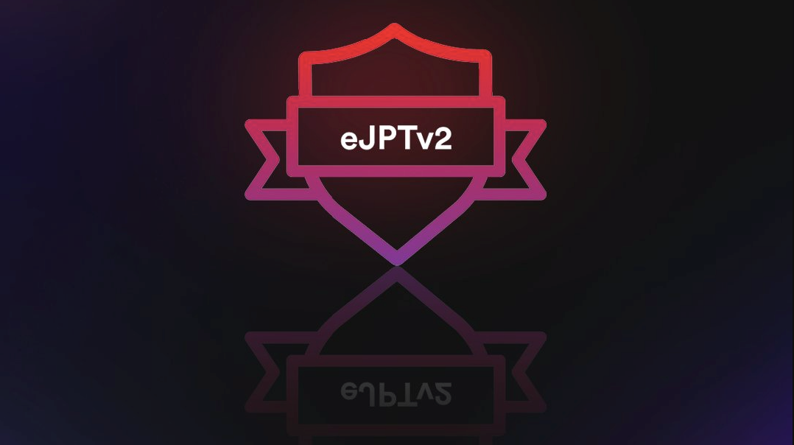

---
layout:
  title:
    visible: true
  description:
    visible: true
  tableOfContents:
    visible: true
  outline:
    visible: true
  pagination:
    visible: true
---

# eJPTv2 Notes

eLearnSecurity Junior Penetration Tester (eJPT) - a practical certification on penetration testing and information security essentials - training by the INE PTSv2 learning path

<figure><figcaption>
eJPT - © eLearnSecurity | INE
</figcaption></figure>

## [PTSv2 Learning Path](https://my.ine.com/CyberSecurity/learning-paths/61f88d91-79ff-4d8f-af68-873883dbbd8c/penetration-testing-student) 

* covers pre-requisite topics introducing information security, programming and pentesting
* prepares for the eJPT exam & certification
* provides the skills and practice to start a pentesting career as an entry-level position

### Course duration & Topics 

\~ 156 hours 17 mins

Activities: **4** sections , **12** courses , **239** videos, **164** quizzes, **121** labs

* [**Assessment Methodologies & Auditing**](https://blog.syselement.com/ine/courses/ejpt/assessment-methodologies) \~ 31 hours 30 mins
* Host & Networking Auditing \~ 2 hours 14 mins
* [**Host & Network Penetration Testing**](https://blog.syselement.com/ine/courses/ejpt/hostnetwork-penetration-testing) \~ 113 hours 22 mins
* [**Web Application Penetration Testing**](https://blog.syselement.com/ine/courses/ejpt/webapp-penetration-testing) \~ 9 hours 5 mins

### Useful links 

* Where to find the PTSv2 (Penetration Testing Student v2) course? - [INE Learning Paths](https://my.ine.com/learning-paths)
* Where to find the eJPT certification exam? - [eJPT](https://security.ine.com/certifications/ejpt-certification/)
* As these notes started with my PTS v1 study, I've decided to keep my [**Penetration Testing Prerequisites** notes here](https://blog.syselement.com/ine/courses/ejpt/penetration-testing-prerequisites) based on the (discontinued) PTSv1 course.
* 🔬 For the **training** part I will use the provided INE Labs Environment (with the `PTSv2 paid course`) and I will link the labs from the [Attack-Defense](https://attackdefense.com/members) platform by PentesterAcademy (`subscription required`)

## [eJPT](https://ine.com/learning/certifications/internal/elearnsecurity-junior-penetration-tester-cert) Exam 

* Time limit: 2 days (**48 hours** lab on)
* Questions: **35**
* Expiration date: yes (3 years)
* Objectives:
  * **Assessment Methodologies Domain (25% of exam):**
    * Evaluate information and criticality or impact of vulnerabilities
    * Identify open ports and services on a target
    * _Exam Score to pass_: at least **`90%`**
  * **Host and Network Auditing Domain (25% of exam):**
    * Gather hash/password information from target
    * Enumerate network information from files on target
    * _Exam Score to pass_: at least **`80%`**
  * **Host and Network Pen Testing Domain (35% of exam):**
    * Conduct brute-force password attacks
    * Conduct exploitation with Metasploit
    * _Exam Score to pass_: at least **`70%`**
  * **Web Application Pen Testing Domain (15% of exam):**
    * Exploit web app vulnerabilities
    * Locate hidden files and directories
    * _Exam Score to pass_: at least **`60%`**
* _Overall Exam score_: **at least `70%` + above minimum score requirements in each domain section**
* From a **technical perspective** the exam is set out to simulate a black box penetration test
  * minimal amount of information about the target network
  * in browser labs (no vpn)
  * a complete unrestricted access to the lab environment for the entire duration of the exam
  * letter of engagement
* Flexible structure for the user
* Hands-on, open book
* **Dynamic flags**: randomly generated flags injected into the lab environment
* Testing your ability to **find the answer**. How you do it is up to you.

> 📖 Read the [Letter Of Engagement](https://media.graphassets.com/RdsCvab8SvacedNV5k4V)
>
> 📖 Read the [Lab Guidelines](https://media.graphassets.com/26hoOMeZQDyu7QJQlvaJ)

***
